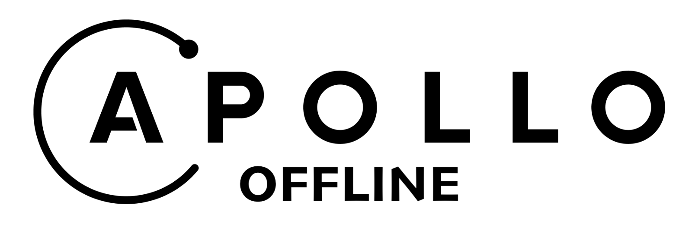

# Apollo Offline

Community extensions to Apollo GraphQL providing:

- Offline support:
  +  Creation, Edits and Deletion operations when offline
- Request Queue offering scheduling and advanced control over data replication
- Listeners for UI
- Working seamlessly with OptimisticUI and CacheUpdates
- Conflict resolution using different Conflict resolution strategies.
- Out of the box Subscriptions and Binary upload that works offline.
- Multi platform support. Works with Web, Cordova, Capacitor and React Native.
- Framework agnostic (works with React, Angular and Vue)

## Documentation

[Documentation](./docs/)

## Roadmap

- Support for non blocking mutations
- Observable based queue listeners
- More comprehensive Documentation and Getting Started Experience
- Support for Native platforms (Android/IOS)
