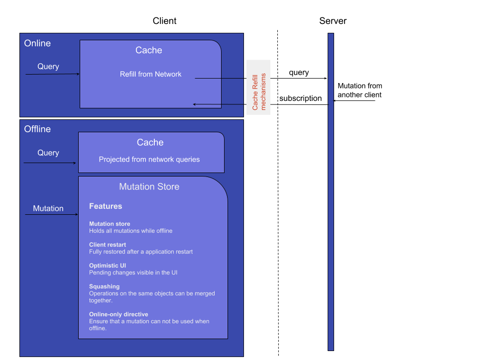
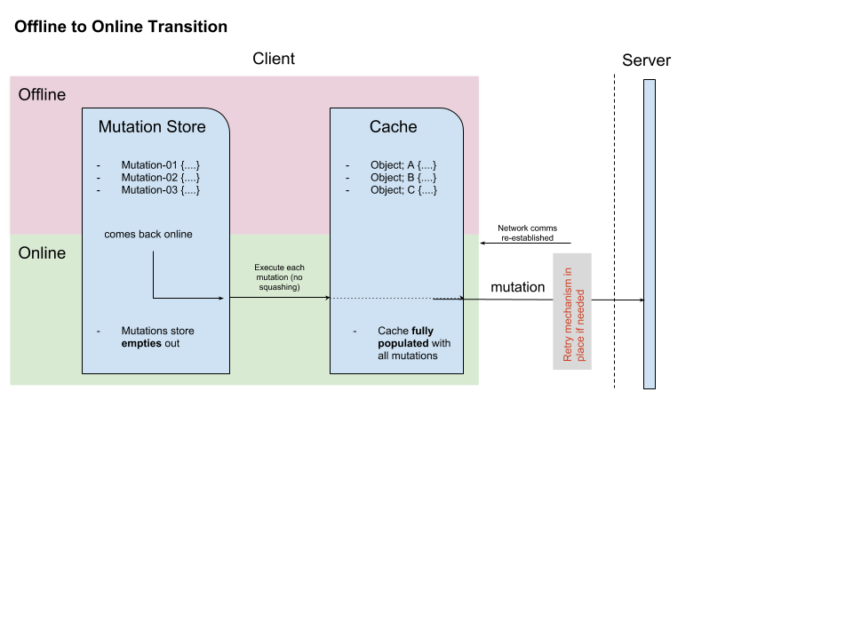

# AeroGear Voyager GraphQL client

Client JavaScript library for [Voyager GraphQL Server](https://github.com/aerogear/voyager-server)

# Getting Started

## Importing the package
```javascript
import {
  createClient,
  strategies
} from '@aerogear/voyager-client';
```

## Configuration

To provide custom configuration to the client, the following options are available. If you wish, these are also available by using the `DataSyncConfig` interface from the SDK.

```javascript

let config: DataSyncConfig = {
  httpUrl: "http://localhost:4000/graphql",
  wsUrl: "ws://localhost:4000/graphql",
}
```

## Creating a Client
```javascript
let client = createClient(config);
```
# Example application

Try SDK using sample application:
https://github.com/aerogear/voyager-ionic-example


# Basic concepts

Client is basing on Apollo GraphQL client that can be used with various web and mobile frameworks.
We provide version for web and Apache Cordova.
For basic concepts about Apollo GraphQL please refer to documentation for your own platform.

For React:
https://www.apollographql.com/docs/react/

For Angular:
https://www.apollographql.com/docs/angular/


## Cache

Client is strongly leveraging Apollo Cache layer.
Please follow documentation for more information about caching in Apollo GraphQL

https://www.apollographql.com/docs/react/advanced/caching.html

### Querying your data

Cache is used to hold data that can be fetched when client is offline.
To effectively work with cache users can use `cache-first` fetchPolicy
when performing queries. This policy will try to use local cache in
situations when cache was already populated with the server side data.

```
    return this.apollo.watchQuery<YourType>({
      query: YOUR_QUERY,
      fetchPolicy: 'cache-first',
    });
```

Cache is going to be refueled by subscriptions, pooling or regular queries happening in UI.

## Designing your types

When designing your GraphQL schema types `id` field will be always required.
We also expect that id will be always queried back from server.
Library will perform business logic assuming that `id` field will be supplied and returned from server. Without this field some offline functionalities will not work properly.


# Offline support

SDK provides first class support for performing GraphQL operations while offline.
Queries and mutations are hold in queue that is being configured to hold requests when client goes offline.
When client goes offline for long periods of time clients will be able still negotiate local updates with the server state thanks to powerful conflict resolution strategies.



Client offers comprehensive set of features to perform data operations when offline.
Thanks to offline mutation store users can stage their changes to be replicated back
to server when becoming online:




Please follow chapters bellow for more information.

## Querying local cache

By default client will save all performed query results in the cache.
Data will be available to be used when application goes offline.
Queries are cached out of the box based on the type and `id` field.
When performing mutations that affects some queries users can use `refetchQueries` or `update` methods:

```
    client.mutate<Task>({
      mutation: ADD_TASK, variables: item,
      optimisticResponse: createOptimisticResponse('createTask', 'Task', item),
      update: this.updateCacheOnAdd
    });
```

## Making modifications when offline

AeroGear Sync SDK provides queue that stores mutations performed when offline.
By default queue saves data in storage to be available after application restarts.
Queue will hold requests until application will come back online.

Developers can adjust how queue will process new mutations by supplying custom `NetworkStatus` implementation.

### Online Only Queries

To ensure certain queries are not queued and are always delivered to the network layer, you must make use of Graphql directives.
To do so on your client, ensure the query has the annotation attached like so:

```
exampleQuery(...) @onlineOnly {
  ...
}
```

### Squashing Mutations

Multiple changes performed on the same object ID and with the same mutation will automatically be joined by the AeroGear Sync SDK when your client is offline. This is beneficial as the client will not have to queue a large amount of mutations to replay once it returns online.

#### Global Squashing
This feature is on by default at a global level. To disable it on a global level simply do so in your config:

```javascript
let config = {
...
  mergeOfflineMutations: false
...
}
```

#### Mutation Level Squashing
To disable this feature at a mutation level be sure to include the annotation on the mutation like so:

```
exampleMutation(...) @noSquash {
  ...
}
```

## Listening for Events

It is possible to provide `offlineQueueListener` in config to be notified about offline related events:

- `onOperationEnqueued` - Called when new operation is being added to offline queue
- `onOperationSuccess` - Called when back online and operation succeeds
- `onOperationFailure` - Called when back online and operation fails with GraphQL error
- `queueCleared` - Called when offline operation queue is cleared

## Conflicts

When obtaining copy of the server side data, client data can get out of the sync.
Edits that happened on the client data need to be replicated back to server.
When replicating local changes to server it may happen that local changes no longer reflect the server state.
This situations are often called "Data Conflicts" or "Data Collisions"

Voyager client offers way to detect and handle conflicts for any GraphQL type by supplying
`ConflictLink` implementation to client.
When collision is detected it can be handled on both server or client.

See Voyager Server documentation for information about writing conflicts for the server.

### Working with plugable conflict implementations

Plugable conflict resolution allows developers to define way to determine how conflicts are detected and handled.
Conflict resolution can be fully controlled by server side implementation.
If users chose to resolve conflicts in the client they need to configure their resolvers first return conflict back to client.
Client will resolve them automatically basing on current strategy and notify listeners if developer supplied any.

Conflict resolution will work out of the box with recommended defaults and do not require any specific handling on the client.

> Advanced users may customize conflict implementation by supplying custom `conflictStateProvider` in config.

### Default conflict implementation

By default plugable conflict resolution is configured to rely on `version` field on each
GraphQL type.
For example:

``
type User {
  id: ID!
  version: String!
  name: String!
}
``

Version field is going to be controlled on the server and will map last version
that was sent from server. All operations on version field happen automatically
however users need to make sure that version field is always being passed to server
for mutations that supports conflict resolution:

```
type Mutation {
  updateUser(id: ID!, version: String!): User
}
```

Alternatively developers can create input element that can be reused in every mutation
that supports conflict resolution

```
type Mutation {
  updateUser(user: UserInput): User
}
```

### Conflict resolution strategies

Client can define custom resolution strategies.
You can provide custom conflict resolution strategies to the client in the config by using the provided `ConflictResolutionStrategy` type from the SDK. By default developers do not need to pass any strategy (`clientVersionWins` strategy is used).
Custom strategies can be used also to provide different resolution strategy for certain operations:


```javascript
let clientWins = (operation, serverData, clientData) => {
  if(operation === 'updateUser'){
      delete clientData.socialKey
      return Object.assign(serverData, clientData);
  }
  else return clientWins(operation, serverData, clientData);
};
```

> Note: Client strategies will work only when specific server side resolver explicitly states that conflicts should be fixed on the client. Client strategy will be ignored when conflict is resolved on the server.

To use strategy pass it as argument to conflictStrategy in your config object:

```javascript
let config = {
...
  conflictStrategy: clientWins
...
}
```

### Listening to conflicts

Framework allows to receive information about the data conflict that occurred between client and server. Client will be notified for both server and client conflicts.

Developers can supply their own `conflictListener` implementation


```typescript
class ConflictLogger implements ConflictListener {
    console.log(`data: ${JSON.stringify(resolvedData)}, server: ${JSON.stringify(server)} client: ${JSON.stringify(client)} `);
  }
}

let config = {
...
  conflictListener: new ConflictLogger()
...
}
```

# Advanced topics

## Implementing Custom Apollo Links

To use your own custom apollo links to create your own set of operation processors, simply follow the documentation for creating links here: https://www.apollographql.com/docs/link/index.html. You can pass this building mechanism to your client in the config, under the `customLinkBuilder` parameter.

```javascript
export const linkBuilder: LinkChainBuilder = (): ApolloLink => {
    const httpLink = new HttpLink({ uri: "someUri" });
    const customLink = new YourCustomLink();

    let links: ApolloLink[] = [customLink, httpLink];

    let compositeLink = ApolloLink.from(links);
    return compositeLink;
  };
```

## Implementing Custom Network Status checks

To use your own custom network checks, implement the [NetworkStatus](https://github.com/aerogear/aerogear-js-sdk/blob/master/packages/sync/src/offline/NetworkStatus.ts)
 interface which provides two functions;

```javascript
  onStatusChangeListener(callback: NetworkStatusChangeCallback): void;

  isOffline(): boolean;
```

## Logging debug messages

Sync package is using debug package to print out debug messages

To enable debug please execute in console
`localStorage.debug = 'AeroGearSync:*'`

Some certain features can be enabled separately

`localStorage.debug = 'AeroGearSync:OfflineMutations*'`

## Optimistic UI

By default user changes that are made when offline will not appear in the app
until they going to be synced to server. In some circumstances users may want to see them instantly to perform various operations on the data
When performing mutations users can decide to supply `optimisticResponse` object that will
appear instantly in the application UI. SDK provides helper method to work with optimistic responses.

```
 import { createOptimisticResponse } from "@aerogear/datasync-js";

 createOptimisticResponse("updateTest", "Test", { data: "test" });
```

Users can detect if the provided data is optimistic response by checking `optimisticResponse` flag is set to true.

### Mapping Client and Server ID for Optimistic Reponses

When using `OptimisticReponse` helper from SDK specific mutations that create new element response is going to have client side generated id. Subsequent edits for this objects will also refer to this id. When becoming online, all offline changes are going to be performed in specific order updating client side id with id returned from server for subsequent edits.

## Listening to the offline queue events

Developers can implement `offlineQueueListener` that can be passed as config element.
This listener is going to be notified about new items that were added to offline queue.
Listener can be used to build UI support and show pending changes.
This feature can be mixed together with `OptimisticResponse` to deliver great offline experience
See example application for more information.

